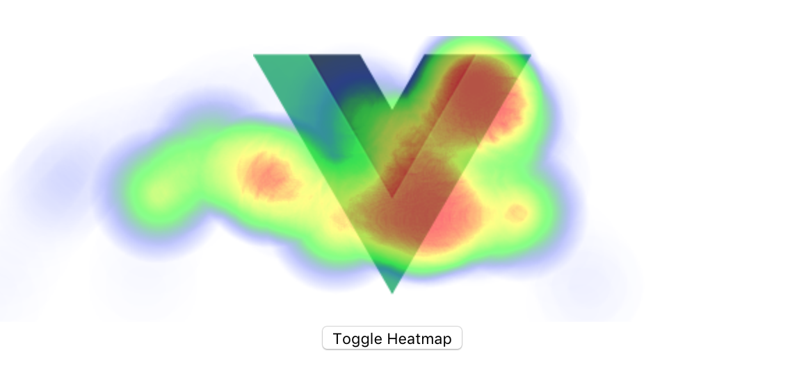

# vue-heatmapjs
[](https://badge.fury.io/js/vue-heatmapjs)


> A vue directive for collecting and displaying user activity on a component

## [Demo](https://vue-heatmapjs.netlify.com)
## Install
You can use NPM or Yarn to add this plugin to your project
```bash
npm install vue-heatmapjs
# or
yarn add vue-heatmapjs
```

## Usage
You need to install this plugin in you main.js

```js
// main.js

import Vue from 'vue'
import heatmap from 'vue-heatmapjs'

Vue.use(heatmap)

```
### v-heatmap
And then you can add the `v-heatmap` directive to the dom elements you want to track.

```html
<!-- App.vue -->
<div v-heatmap>
  ...
</div>
```

### v-scrollmap
You can use the `v-scrollmap` directive to collect scroll position data from your application

```html
<!-- App.vue -->
<div v-scrollmap>
  ...
</div>
```

### Toggle heatmap
You can toggle the heatmaps on and off by passing an expression into the directive, the example below will produce something similar to the image at the top of these docs

```html
<template>
  ...
  <div v-heatmap="show" v-scrollmap="show"></div>
  <button @click="show = !show">Toggle Heatmap</button>
  ...
</template>

<script>
  ...
    data() {
      return {
        show: false,
      }
    },
  ...
</script>
```

### Listen for events
**Streams**

You can pass in an Observable into the plugin options and subscribe to events captured for the heatmaps.

```js
// main.js
import { Subject } from 'rxjs';

const stream = new Subject();
Vue.use(Vueheatmap, {
  stream,
});

stream.subscribe(console.log);
```


**Callback**

You can pass an afterAdd method through with the plugin options, this will allow you to access and process the events captured for the heatmap

```js
// main.js

Vue.use(heatmap, {
  afterAdd(data) {
    console.log(data)
    // you can fire this back to your analytics server
  },
})
```

### Pause collection
You can pass an RXJS Subject through with the plugin options that will allow you to toggle whether your directives collect data or not

```js
//main.js
export const pauser = new Subject();

Vue.config.productionTip = false;
Vue.use(Vueheatmap, {
  pauser,
});
```

```js
// Pause data collection
pauser.next(true);
// Resume data collection
pauser.next(false);
```

### Preload heatmap
Once you have captured heatmap data and persisted the data somewhere you will probably need a way of loading this data back in to your heatmap.

You can pass in an array of heatmap events using the heatmap preload plugin option

```js
//main.js
Vue.use(Vueheatmap, {
  heatmapPreload: [{ x: 10, y: 10, value: 100 }],
});
```

The plugin can also handle a Promise
```js
//main.js
Vue.use(Vueheatmap, {
  heatmapPreload: fetch('http://api.example.com').then(response => response.json()),
});
